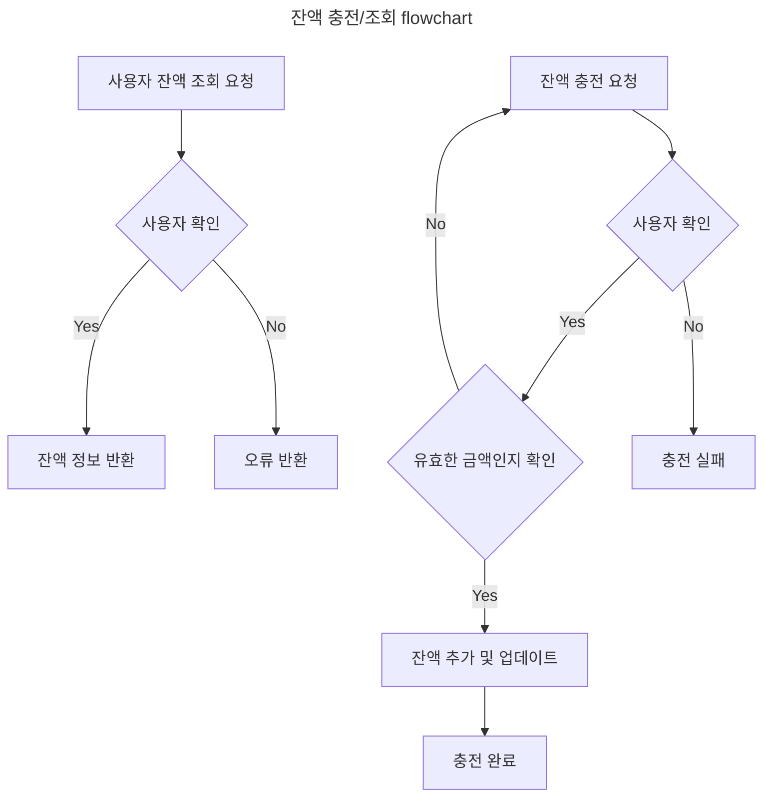
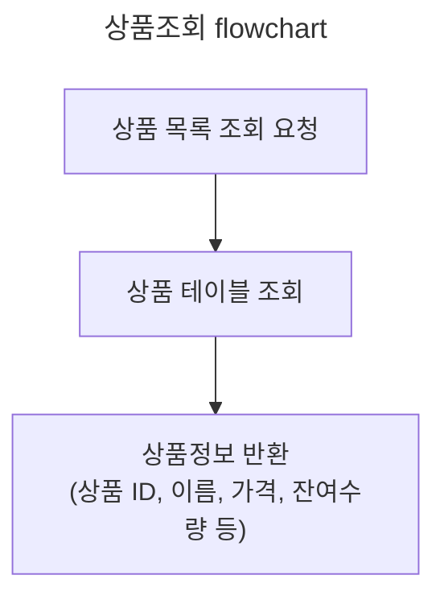
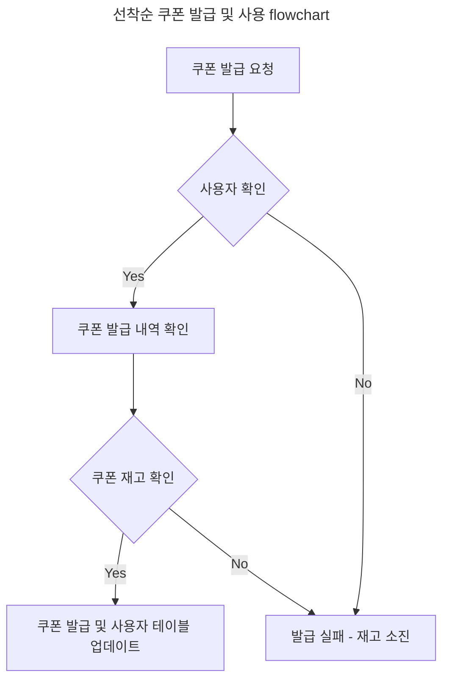
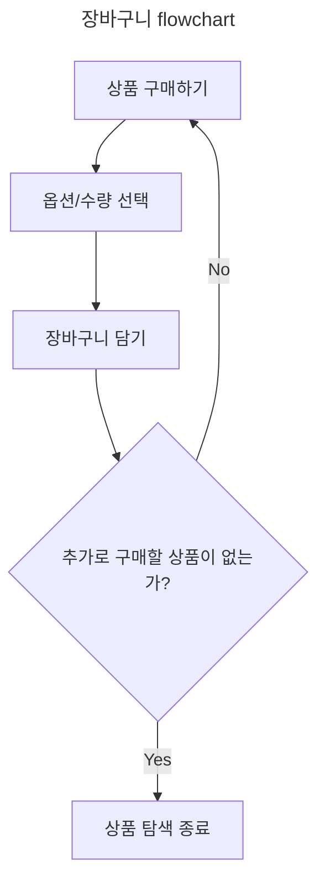
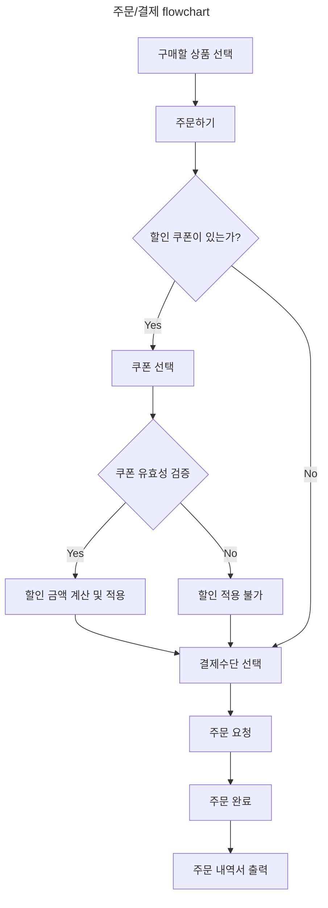
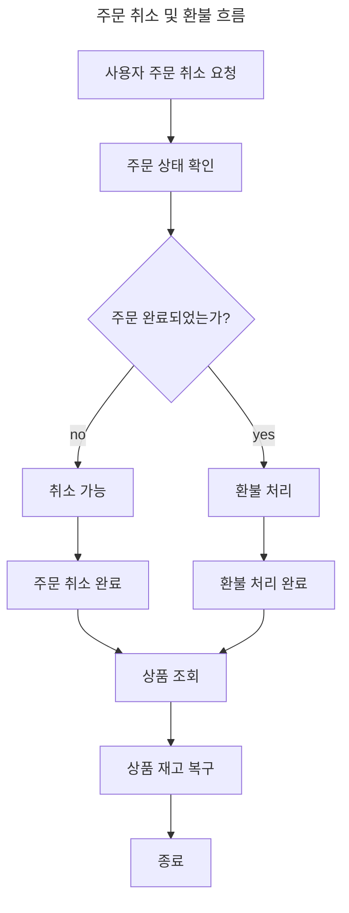
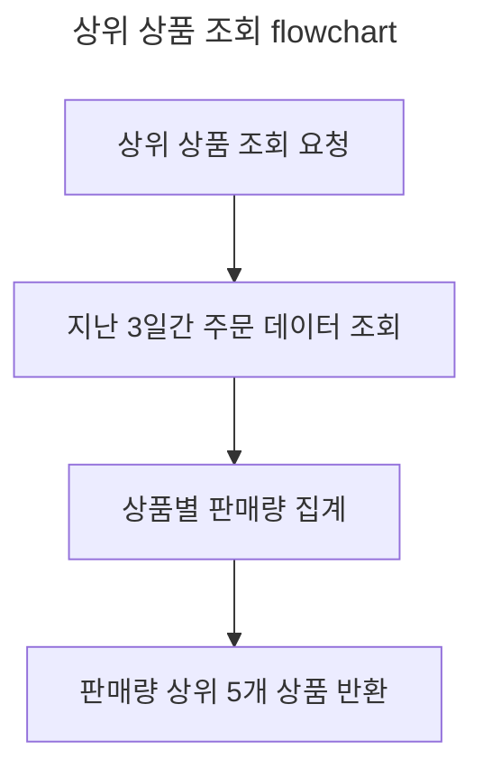
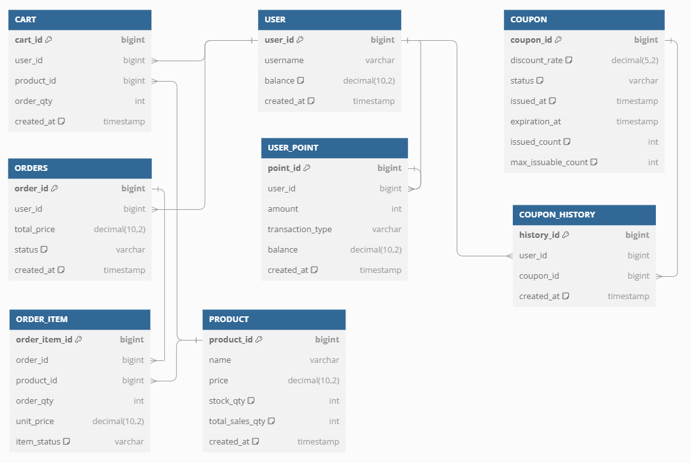

# e-commerce Milestone

# 플로우 차트(Flowcharts)

# ERD 테이블 명세서

---

## 테이블 개요

# 데이터베이스 스키마 개요

이 데이터베이스의 주요 엔티티는 `USER`, `CART`, `PRODUCT`, `COUPON`, `COUPON_HISTORY`, `ORDERS`, `ORDER_ITEM`, `USER_POINT`입니다. 각 테이블은
전자상거래 시스템을 모델링하며, 사용자의 관리, 제품, 장바구니, 주문, 포인트 등을 다룹니다.

## 테이블 설명 및 관계

### `USER` 테이블

`USER` 테이블은 플랫폼에 등록된 사용자의 정보를 저장합니다.

| 필드           | 타입             | 설명                   |
|--------------|----------------|----------------------|
| `user_id`    | BIGINT         | 기본 키, 자동 증가          |
| `username`   | VARCHAR(255)   | 사용자 이름 (고유값)         |
| `balance`    | DECIMAL(10, 2) | 사용자 잔액, 기본값 0.00     |
| `created_at` | TIMESTAMP      | 계정 생성 일시, 기본값은 현재 시간 |

`USER` 테이블은 다른 여러 테이블에서 `user_id`를 외래 키로 참조하고 있습니다.

### `PRODUCT` 테이블

`PRODUCT` 테이블은 판매되는 제품에 대한 정보를 저장합니다.

| 필드                | 타입             | 설명                   |
|-------------------|----------------|----------------------|
| `product_id`      | BIGINT         | 기본 키, 자동 증가          |
| `name`            | VARCHAR(255)   | 제품 이름                |
| `price`           | DECIMAL(10, 2) | 제품 가격                |
| `stock_qty`       | INT            | 재고 수량                |
| `total_sales_qty` | INT            | 총 판매 수량, 기본값은 0      |
| `created_at`      | TIMESTAMP      | 제품 생성 일시, 기본값은 현재 시간 |

### `CART` 테이블

`CART` 테이블은 사용자가 장바구니에 담은 제품을 추적합니다.

| 필드           | 타입        | 설명                               |
|--------------|-----------|----------------------------------|
| `cart_id`    | BIGINT    | 기본 키, 자동 증가                      |
| `product_id` | BIGINT    | `PRODUCT` 테이블의 `product_id` 외래 키 |
| `user_id`    | BIGINT    | `USER` 테이블의 `user_id` 외래 키       |
| `order_qty`  | INT       | 장바구니에 담은 제품 수량                   |
| `created_at` | TIMESTAMP | 장바구니에 제품을 담은 시간                  |

`CART` 테이블은 `USER`와 `PRODUCT` 테이블과 각각 관계를 맺고 있습니다. 각 사용자는 여러 개의 장바구니 항목을 가질 수 있으며, 각 항목은 특정 제품에 대한 정보입니다.

### `COUPON` 테이블

`COUPON` 테이블은 플랫폼에서 발행한 할인 쿠폰에 대한 정보를 관리합니다.

| 필드                   | 타입            | 설명                               |
|----------------------|---------------|----------------------------------|
| `coupon_id`          | BIGINT        | 기본 키, 자동 증가                      |
| `discount_rate`      | DECIMAL(5, 2) | 할인율, 기본값은 10% (0.10)             |
| `status`             | VARCHAR(20)   | 쿠폰 상태 (예: 'PENDING', 'ISSUED' 등) |
| `issued_at`          | TIMESTAMP     | 쿠폰 발행 일시                         |
| `expiration_at`      | TIMESTAMP     | 쿠폰 만료 일시                         |
| `issued_count`       | INT           | 발행된 쿠폰 수량, 기본값은 0                |
| `max_issuable_count` | INT           | 발행 가능한 최대 쿠폰 수량                  |

### `COUPON_HISTORY` 테이블

`COUPON_HISTORY` 테이블은 사용자가 발급받은 쿠폰의 기록을 저장합니다.

| 필드           | 타입        | 설명                             |
|--------------|-----------|--------------------------------|
| `history_id` | BIGINT    | 기본 키, 자동 증가                    |
| `user_id`    | BIGINT    | `USER` 테이블의 `user_id` 외래 키     |
| `coupon_id`  | BIGINT    | `COUPON` 테이블의 `coupon_id` 외래 키 |
| `created_at` | TIMESTAMP | 쿠폰 발급 시간                       |

`COUPON_HISTORY` 테이블은 `USER`와 `COUPON` 테이블과 관계를 맺고 있습니다. 각 사용자는 여러 개의 쿠폰을 발급받을 수 있으며, 각 쿠폰은 특정 사용자에게 발급됩니다.

### `ORDERS` 테이블

`ORDERS` 테이블은 사용자가 만든 주문에 대한 정보를 저장합니다.

| 필드            | 타입             | 설명                                  |
|---------------|----------------|-------------------------------------|
| `order_id`    | BIGINT         | 기본 키, 자동 증가                         |
| `user_id`     | BIGINT         | `USER` 테이블의 `user_id` 외래 키          |
| `total_price` | DECIMAL(10, 2) | 주문 총액                               |
| `status`      | VARCHAR(20)    | 주문 상태 (예: 'COMPLETED', 'PENDING' 등) |
| `created_at`  | TIMESTAMP      | 주문 생성 일시                            |

### `ORDER_ITEM` 테이블

`ORDER_ITEM` 테이블은 각 주문에 포함된 제품에 대한 정보를 저장합니다.

| 필드              | 타입             | 설명                                |
|-----------------|----------------|-----------------------------------|
| `order_item_id` | BIGINT         | 기본 키, 자동 증가                       |
| `order_id`      | BIGINT         | `ORDERS` 테이블의 `order_id` 외래 키     |
| `product_id`    | BIGINT         | `PRODUCT` 테이블의 `product_id` 외래 키  |
| `order_qty`     | INT            | 주문된 제품 수량                         |
| `unit_price`    | DECIMAL(10, 2) | 제품 단가                             |
| `item_status`   | VARCHAR(20)    | 아이템 상태 (예: 'ACTIVE', 'SHIPPED' 등) |

### `USER_POINT` 테이블

`USER_POINT` 테이블은 사용자의 포인트 거래 내역을 관리합니다.

| 필드                 | 타입             | 설명                                   |
|--------------------|----------------|--------------------------------------|
| `point_id`         | BIGINT         | 기본 키, 자동 증가                          |
| `user_id`          | BIGINT         | `USER` 테이블의 `user_id` 외래 키           |
| `amount`           | INT            | 포인트 거래 금액                            |
| `transaction_type` | VARCHAR(20)    | 거래 유형 (예: 'CHARGE', 'USE', 'REFUND') |
| `balance`          | DECIMAL(10, 2) | 거래 후 잔액                              |
| `created_at`       | TIMESTAMP      | 거래 일시                                |

## 테이블 간의 관계

- `USER`와 `CART`, `ORDERS`, `USER_POINT`, `COUPON_HISTORY`는 `user_id`로 연결되어 있습니다. 각 사용자는 여러 장바구니, 주문, 포인트 거래, 쿠폰 히스토리를
  가질 수 있습니다.
- `PRODUCT`와 `CART`, `ORDER_ITEM`은 `product_id`로 연결되어 있으며, 각 제품은 여러 장바구니 항목과 주문 항목에 포함될 수 있습니다.
- `COUPON`은 `COUPON_HISTORY`와 연결되어, 각 사용자가 어떤 쿠폰을 발급받았는지를 추적합니다.
- `ORDERS`와 `ORDER_ITEM`은 `order_id`로 연결되어 있어, 각 주문은 여러 주문 항목을 가질 수 있습니다.

