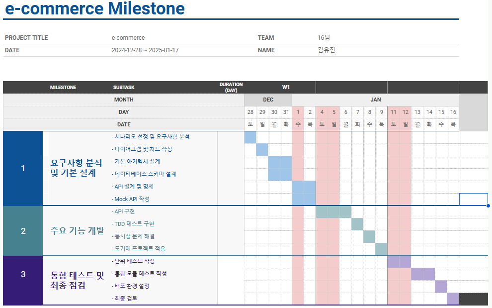
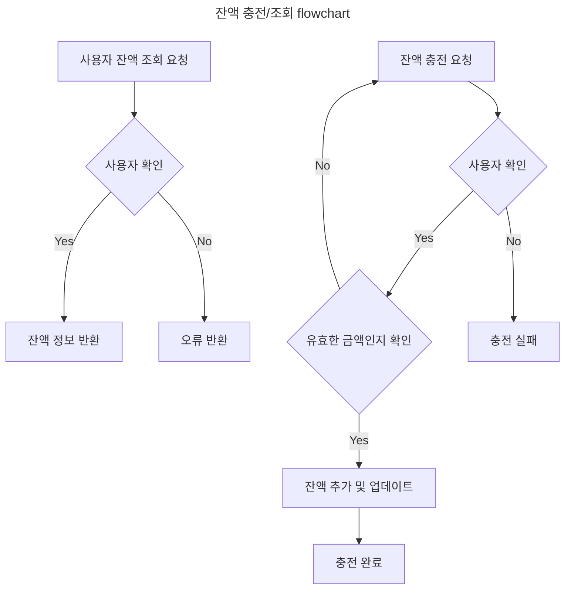
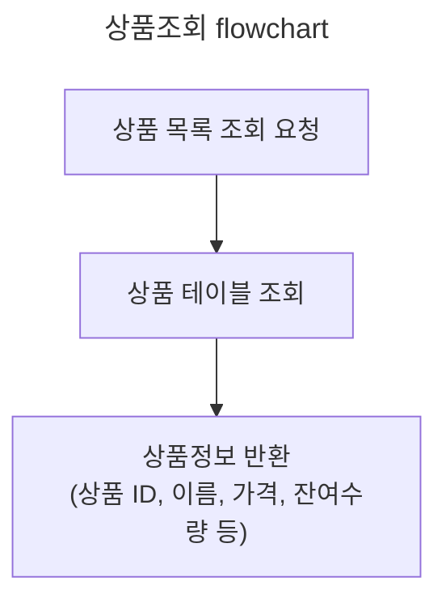
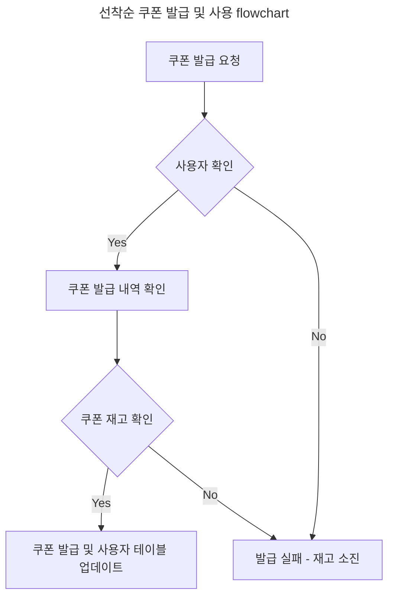
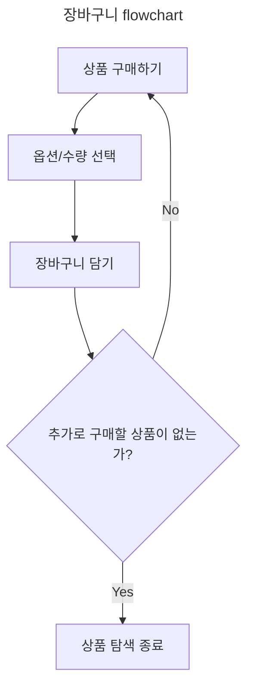
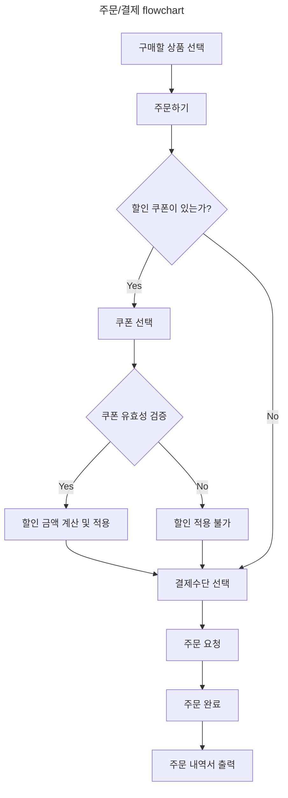
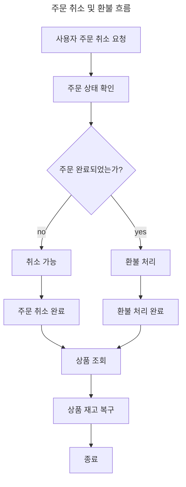
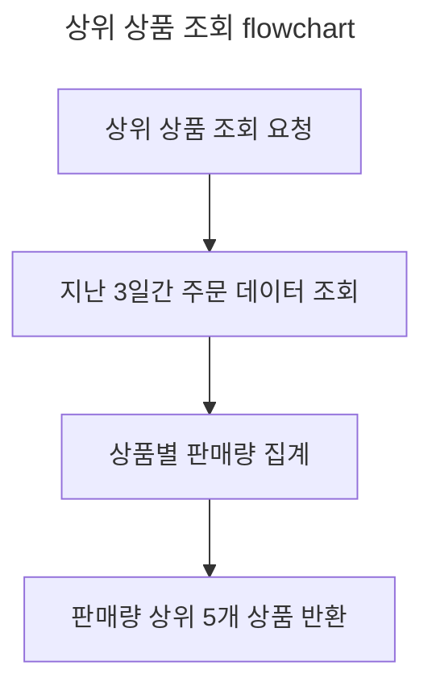

# e-commerce Milestone

# 플로우 차트(Flowcharts)

```mermaid
---
title: 잔액 충전/조회 flowchart
---
graph TD
    A[사용자 잔액 조회 요청] --> B{사용자 확인}
    B -->|Yes| C[잔액 정보 반환]
    B -->|No| D[오류 반환]
    E[잔액 충전 요청] --> F{사용자 확인}
    F -->|Yes| G{유효한 금액인지 확인}
    F -->|No| H[충전 실패]
    G -->|Yes| I[잔액 추가 및 업데이트]
    G -->|No| E[잔액 충전 요청]
%% 유효한 금액이 아니면 다시 충전 요청으로 돌아감
    I --> K[충전 완료]


``` 

```mermaid
---
title: 상품조회 flowchart
---
graph TD
    A[상품 목록 조회 요청] --> B[상품 테이블 조회]
    B --> C["상품정보 반환\n(상품 ID, 이름, 가격, 잔여수량 등)"]
```

```mermaid
---
title: 선착순 쿠폰 발급 및 사용 flowchart
---
graph TD
    A[쿠폰 발급 요청] --> B{사용자 확인}
    B -->|Yes| C[쿠폰 발급 내역 확인]
    B -->|No| F[발급 실패 - 사용자 확인 실패]
    C --> D{쿠폰 재고 확인}
    D -->|Yes| E[쿠폰 발급 및 사용자 테이블 업데이트]
    D -->|No| F[발급 실패 - 재고 소진]

```

```mermaid
---
title: 장바구니 flowchart
---
flowchart TD
    A[상품 구매하기] --> B[옵션/수량 선택]
    B --> C[장바구니 담기]
    C --> D{추가로 구매할 상품이 없는가?}
    D -->|Yes| E[상품 탐색 종료]
    D -->|No| A
```

```mermaid
---
title: 주문/결제 flowchart
---
flowchart TD
    A[구매할 상품 선택] --> B[주문하기]
    B --> C{할인 쿠폰이 있는가?}
    C -->|Yes| D[쿠폰 선택]
    D --> E{쿠폰 유효성 검증}
    E -->|Yes| F[할인 금액 계산 및 적용]
    E -->|No| G[할인 적용 불가]
    F --> H[결제수단 선택]
    G --> H[결제수단 선택]
    C -->|No| H[결제수단 선택]
    H --> I[주문 요청]
    I --> J[주문 완료]
    J --> K[주문 내역서 출력]

```

```mermaid
---
title: 주문 취소 및 환불 흐름
---
flowchart TD
    A[사용자 주문 취소 요청] --> B[주문 상태 확인]
    B --> C{주문 완료되었는가?}
    C -- yes --> D[환불 처리]
    C -- no --> E[취소 가능]
    E --> G[주문 취소 완료]
    D --> F[환불 처리 완료]
    G --> H[상품 조회]
    F --> H --> I[상품 재고 복구]
    I --> J[종료]
```

```mermaid
---
title: 상위 상품 조회 flowchart
---
graph TD
    A[상위 상품 조회 요청] --> B[지난 3일간 주문 데이터 조회]
    B --> C[상품별 판매량 집계]
    C --> D[판매량 상위 5개 상품 반환]

``` 